# School District Analysis

## Overview of the school district analysis: Explain the purpose of this analysis. 
Maria is the chief data scientist for a city school district and is reponsible for analyzing information from a variety of sources. In this role, The school board has notified Maria and her supervisor that the students_complete.csv file shows evidence of academic dishonesty; specifically, reading and math grades for Thomas High School ninth graders appear to have been altered. They have turned to Maria for help. She asked us to replace the math and reading scores for Thomas High School 9th graders with NaNs while keeping the rest of the data intact. Maria would like us to repeat the school district analysis using Jupiter notebook with Python, Pandas library to write a report to describe how these changes affected the overall analysis. 
## Results: Using bulleted lists and images of DataFrames as support, address the following questions.

#### 1) How is the district summary affected?
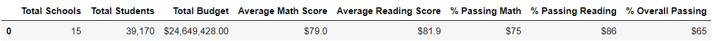
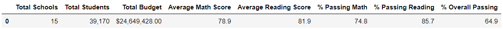
When comparing the two datas we can see that removing 461 students 9th graders barely affected the data.
#### 2) How is the school summary affected?
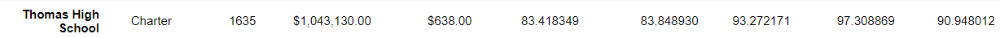
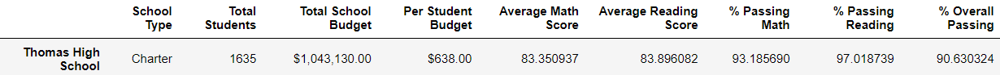
In this opportunity, we can tell the big difference removing the 9th grader out of Thomas High school. The % Overall passing drops 26%...
#### 3) How does replacing the ninth graders’ math and reading scores affect Thomas High School’s performance relative to the other schools?
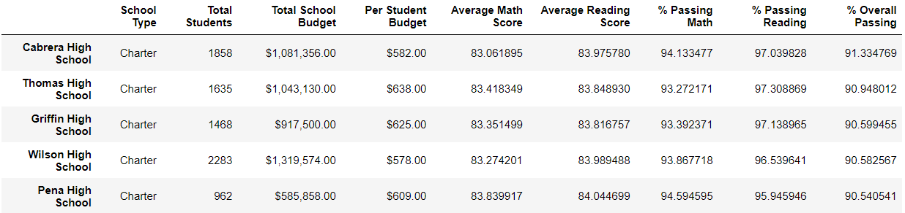
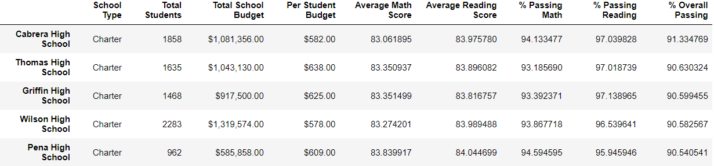

Compating both chart, we can tell that it did not affected the raking realated to math and reading scores.
### How does replacing the ninth-grade scores affect the following:
#### 4) Math and reading scores by grade

The only difference between both charts is that the 9th garders at Thomas High School is that it doesnt have a grade(Nan) for math and reading
#### 5) Scores by school spending

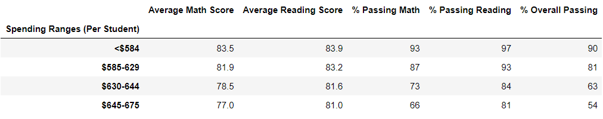
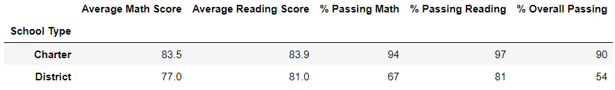

There was almost no impact removing the 9th graders
#### 6) Scores by school size
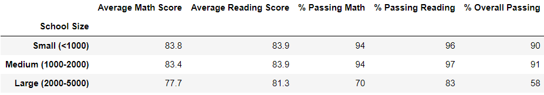
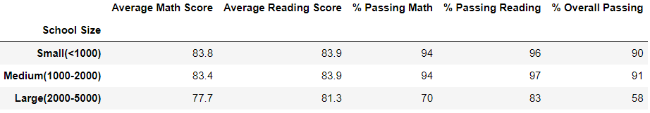

There was almost no impact removing the 9th graders
#### 7) Scores by school type

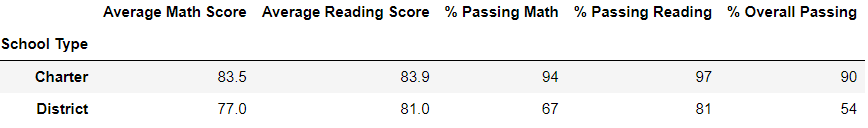
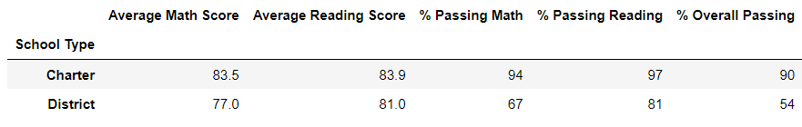

There was almost no impact removing the 9th graders.
## Summary: Summarize four changes in the updated school district analysis after reading and math scores for the ninth grade at Thomas High School have been replaced with NaNs.
