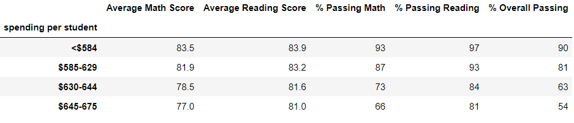

# School District Analysis

## Overview of the school district analysis: Explain the purpose of this analysis. 
Maria is the chief data scientist for a city school district and is reponsible for analyzing information from a variety of sources. In this role, The school board has notified Maria and her supervisor that the students_complete.csv file shows evidence of academic dishonesty; specifically, reading and math grades for Thomas High School ninth graders appear to have been altered. They have turned to Maria for help. She asked us to replace the math and reading scores for Thomas High School 9th graders with NaNs while keeping the rest of the data intact. Maria would like us to repeat the school district analysis using Jupiter notebook with Python, Pandas library to write a report to describe how these changes affected the overall analysis. 
## Results: Using bulleted lists and images of DataFrames as support, address the following questions.

#### 1) How is the district summary affected?
### Original

### NANs 

When comparing the two datas we can see that removing 461 students 9th graders barely affected the data.
#### 2) How is the school summary affected?
### Original

### NANs 

In this opportunity, we see that there was a mininmun drop of less than 0.5%. This means that data still remains almost unaffected.
#### 3) How does replacing the ninth graders’ math and reading scores affect Thomas High School’s performance relative to the other schools?
### Original

### NANs 

Compating both chart, we can tell that it did not affected the raking realated to math and reading scores.
### How does replacing the ninth-grade scores affect the following:
#### 4) Math and reading scores by grade
### Original

### NANs 

The only difference between both charts is that the 9th garders at Thomas High School doesnt have a grades(Nans) for math and reading
#### 5) Scores by school spending
### Original

### NANs 

There was almost no impact removing the 9th graders
#### 6) Scores by school size
### Original

### NANs 

There was almost no impact removing the 9th graders
#### 7) Scores by school type
### Original

### NANs 

There was almost no impact removing the 9th graders.
## Summary: 
district summary: When comparing the two datas we can see that removing 461 students 9th graders barely affected the data

school summary: In this opportunity, we see that there was a mininmun drop of less than 0.5%. This means that data still remains almost unaffected.

Math and Reading scores : It did affect drastically because there absolute nothing to compare since the 9th graders for math and reading are NANs.

Scores by school spending, school size, school type: There was almost no impact removing the 9th graders
